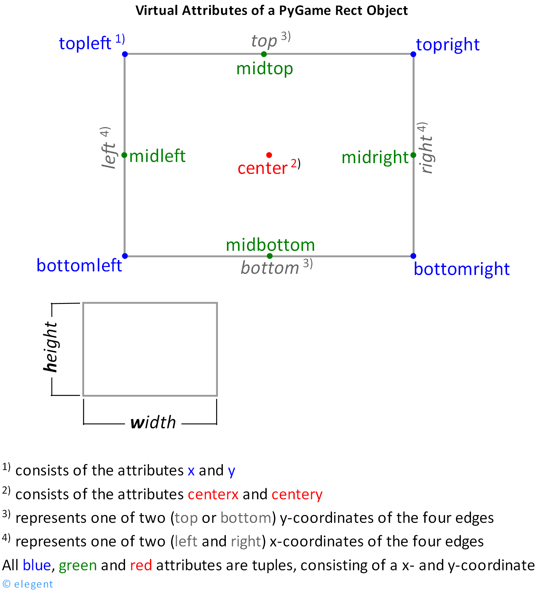

## 项目实践一：Sky Plane Battle 飞机大战（基础版）

### 零、项目概览

#### 0.1 学习目标

本作业以 `game1/` 中已经拆分好的 Pygame 项目为基础。
你需要阅读现有项目结构，根据代码中的 `TODO` 注释，分三个层次逐步补全一款可运行的飞机大战游戏。

完成本作业后，你应能够：
1. 理解 Pygame 游戏的“事件处理 → 状态更新 → 碰撞检测 → 画面绘制”主循环。
2. 使用类描述玩家、敌机和子弹，并理解对象之间如何协作。
3. 使用列表管理数量不断变化的游戏对象，并及时清理失效对象。
4. 使用矩形碰撞和像素遮罩碰撞实现游戏规则。
5. 使用游戏状态组织开始、运行、结束和重新开始流程。
6. 阅读并维护由多个 Python 文件组成的小型项目。

#### 0.2 项目结构与模块职责
| 文件 / 路径 | 类型 | 主要职责与功能 |
|---|---|---|
| `assets/` | 资源目录 | 存放游戏素材，包括玩家飞机、敌机、子弹等图片资源 |
| `game1/main.py` | 程序入口 | 游戏启动文件，调用 `game.py` 中的 `main()` 方法运行游戏 |
| `game1/game.py` | 游戏核心模块 | 负责 Pygame 初始化、游戏主循环、事件处理、对象管理、碰撞检测、分数统计以及游戏状态控制 |
| `game1/settings.py` | 配置模块 | 集中管理游戏参数，包括窗口尺寸、速度、颜色、自定义事件、状态名称和文本等配置 |
| `game1/player.py` | 玩家模块 | 定义 Player 玩家飞机类，实现图片加载、移动控制、边界限制、位置更新、绘制和发射子弹等功能 |
| `game1/enemy.py` | 敌机模块 | 定义 Enemy 敌机类，实现敌机随机生成、移动、越界判断和绘制等功能 |
| `game1/bullet.py` | 子弹模块 | 定义 Bullet 子弹类，实现子弹创建、向上移动、越界判断和绘制等功能 |
| `game1/__init__.py` | 初始化文件 | 标识 `game1` 为 Python 模块包 |
| `hw1.md` | 项目文档 | 记录项目说明、作业要求和开发相关信息 |

#### 0.3 环境配置与操作指南

运行项目需要安装 `pygame` 库。

如果尚未安装，请先执行：

```bash
pip install pygame
```

在项目根目录 `Sky-Plane-Battle/` 下运行：

```bash
python game1/main.py
```

> 注意：需要从项目根目录启动程序，否则 `assets/...` 等相对路径可能无法正确加载游戏资源。

---

游戏启动后，玩家可以进行以下操作：

* **方向键 / `W A S D`**：控制玩家飞机移动。
* **开始界面按任意键**：进入游戏。
* **游戏结束界面按任意键**：重新开始游戏。
* **关闭游戏窗口**：退出程序。
* **自动射击机制**：基础版本采用定时自动发射子弹，不需要玩家手动按键射击。

#### 0.4 开发要求与进阶规则

1. 只补全 `TODO`注释指定的代码，不要删除已有类、函数、参数或随意改变文件职责。
2. 每完成一个层次，都应先运行和测试，再继续下一层。
3. 不允许直接复制完整参考项目或把所有逻辑重新写进一个文件。
4. 可以增加必要的局部变量和辅助注释，但应保持命名清楚、缩进正确。
5. 程序运行期间不应因为普通操作产生异常。
6. 第一层是最低完成要求；第二层建立在第一层之上；第三层建立在前两层之上。

### 一、v1.1：玩家移动与基础游戏循环
完成玩家飞机和基本运动，建立一个能够持续运行的游戏循环。
完成后，玩家可以控制飞机，在界面内上下左右移动，并允许飞机左右两侧适当超出屏幕。

#### 1.1 实现玩家方向控制

涉及文件：`player.py`

需要完成：

1. 在 `Player.move(keys)` 中读取上下左右方向键和 `W/A/S/D`。
2. 左右移动改变 `self.x`，上下移动改变 `self.y`。
3. 使用 `self.speed` 作为每次更新的移动量。
4. 同时按下两个方向键时，允许斜向移动。

提示：`pygame.key.get_pressed()` 返回当前所有按键的状态；方向键常量如 `pygame.K_LEFT`，字母键如 `pygame.K_a`。

#### 1.2 限制玩家移动范围

涉及文件：`player.py`

需要完成：
1. 实现 `Player.stay_in_screen()`。
2. 玩家飞机对象上边不能小于 `0`；左侧可以超出 `PLAYER_OFFSET`。
3. 右侧边界需要考虑玩家飞机对象宽度和 `PLAYER_OFFSET`。
4. 下侧边界需要考虑玩家飞机对象高度。
5. 在 `update()` 中按正确顺序调用移动和边界限制；代码已提供 `rect` 的位置同步。

提示：左右两侧允许适当超出屏幕，超出距离由 `PLAYER_OFFSET` 控制。

#### 1.3 将玩家接入游戏主循环

涉及文件：`game.py`

将玩家对象接入游戏主循环。
1. 创建玩家对象
2. 根据按键更新玩家
3. 绘制玩家

---

完成后运行程序，确认：

- 玩家飞机显示在窗口底部中央。
- 可以使用方向键或 `W/A/S/D` 移动飞机。
- 玩家飞机不会从上下边界移出屏幕，左右两侧最多超出 `PLAYER_OFFSET`。

### 二、v1.2：敌机生成与对象管理
敌机会从屏幕上方随机出现并向下飞行。

#### 2.1 实现敌机创建与移动

涉及文件：`enemy.py`

需要完成：

1. 随机设置敌机的横坐标，范围为 `0` 到 `SCREEN_WIDTH - self.rect.width`；同时将敌机放在屏幕上方。
2. 将敌机的初始位置保存到 `self.x`、`self.y`，并同步到 `self.rect`。
3. 在 `Enemy.update()` 中让敌机按照 `self.speed` 向下移动，并同步 `self.rect.y`。
4. 在 `Enemy.is_out_of_screen()` 中判断敌机是否已经完全飞出屏幕底部，并返回 `True` 或 `False`。

解释说明：
- 可以将初始纵坐标设为 `-self.rect.height`，使敌机从屏幕正上方开始出现。
- 敌机完全离开底部时，`rect.top` 会大于屏幕高度。
- 可以使用 `random.randint()` 生成随机横坐标；
  `random.randint(a, b)`: 返回一个位于 `a` 和 `b` 之间的随机整数（包含 `a` 和 `b`）。


#### 2.2 管理敌机的生成、更新与清理

涉及文件：`game.py`

需要完成：

1. 创建用于管理所有敌机的 `enemies` 列表。
2. 收到 `ADD_ENEMY_EVENT` 时创建一个 `Enemy` 并加入 `enemies` 列表。
3. 每一帧更新列表中的所有敌机。
4. 将已经飞出屏幕的敌机从列表中移除。
5. 每一帧绘制列表中的所有敌机。

提示：敌机生成定时事件已经按照配置的时间间隔注册。
不要一边遍历列表一边直接 `remove()`；可以用**列表推导式**保留仍在屏幕内的对象。

---

**列表推导/生成式（List Comprehension）**

列表推导式是一种**简洁创建列表的方法**，可以通过遍历一个序列，并对每个元素进行处理或筛选，快速生成新的列表。

核心语法：

```python
new_list = [expression for item in old_list if condition]
```

等价于：

```python
new_list = []
for item in old_list:
    if condition:
        new_list.append(expression)
```

示例：

```python
arr1 = [1, -3, 6, -2, 7, 5, -4]

arr2 = [n for n in arr1 if n > 0]
print(arr2)   # [1, 6, 7, 5]

arr3 = [x * x for x in arr2]
print(arr3)   # [1, 36, 49, 25]
```

列表推导式让代码更加简洁，常用于**快速创建、转换和筛选列表**。


---

实现效果
- 游戏窗口能正常打开和关闭。
- 敌机生成时不会超出屏幕左右边界，并从屏幕上方开始出现。
- 敌机会以随机横坐标从屏幕上方不断出现并向下移动。
- 敌机完全离开屏幕后会被清理，长时间运行不会无限积累离屏对象。
- 本版本暂时没有子弹、得分、碰撞和死亡逻辑，能稳定运行。


### 三、v1.3：自动射击与战斗循环
在上一层基础上加入自动射击、子弹与敌机碰撞、对象消失，形成完整的核心战斗循环。

本部分需要拓展学习**rect的细节知识**, 具体看
[https://pygame.readthedocs.io/en/latest/rect/rect.html#](https://pygame.readthedocs.io/en/latest/rect/rect.html#)
- Virtual attributes
- Points of interest
- Colliding points
- Colliding rectangles

补充图解如下

<div align="center">
    
</div>

#### 3.1 实现子弹创建与发射

涉及文件：`settings.py`、`bullet.py`、`player.py`

需要完成：

1. 在配置文件中设置子弹图片路径和合适的飞行速度。
2. 创建子弹时，将子弹图片的底部中点放在玩家飞机的顶部中点。
3. 保存子弹的位置和速度。
4. 在 `Bullet.update()` 中让子弹向屏幕上方移动并同步 `rect`。
5. 在 `Bullet.is_out_of_screen()` 中判断子弹是否已经完全离开屏幕上方。
6. 在 `Player.shoot()` 中创建并返回一个 `Bullet` 对象。

提示：可使用 `rect.midbottom`、玩家的 `rect.centerx` 和 `rect.top` 对齐发射位置。

#### 3.2 管理自动射击与子弹生命周期

涉及文件：`game.py`、`settings.py`

需要完成：

1. 注册射击定时事件。
2. 收到 `SHOOT_EVENT` 时调用 `player.shoot()`，把返回的子弹加入 `bullets` 列表。
3. 每一帧更新并绘制全部子弹。
4. 清理完全飞出屏幕上方的子弹。
5. 只有游戏处于 `PLAYING` 状态时，才允许生成敌机和子弹。

#### 3.3 实现子弹与敌机碰撞

涉及文件：`game.py`

需要完成：

1. 遍历子弹和敌机，使用 `rect.colliderect()` 判断矩形是否相交。
2. 一颗子弹击中一个敌机后，该子弹和该敌机都应消失。
3. 一颗子弹在同一帧最多击中一个敌机。
4. 不要在嵌套遍历过程中直接修改原列表；先记录命中的对象，再统一过滤。

---

完成后效果
- 玩家飞机能够按固定时间间隔自动发射子弹。
- 子弹从玩家飞机顶部中央出现并向上移动。
- 离开屏幕的子弹会被清理。
- 子弹与敌机相交时，两者都消失。

### 四、v1.4：计分、精确碰撞与完整游戏流程

在前三个版本的基础上加入计分、精确碰撞、游戏状态和中英文文本切换，
使项目从“功能演示”升级为流程完整、可重复游玩的游戏。

本版本建议严格按照 **4.1 → 4.2 → 4.3** 的顺序实现：

1. 先建立游戏状态和统一重置逻辑，明确每种状态下程序应该做什么。
2. 再补充像素级碰撞和计分规则，使一局游戏能够正确结束并记录得分。
3. 最后完善各状态的界面、中英文文本和退出流程，形成完整游戏。

#### 4.1 建立游戏状态与统一重置逻辑

涉及文件：`settings.py`、`game.py`

先在 `settings.py` 中定义三种**游戏状态常量**，分别表示游戏的不同阶段。
| 状态名称               | 状态值 | 游戏行为                             |
| ------------------ | --- | -------------------------------- |
| `STATUS_START`     | `0` | 开始界面，等待玩家开始游戏；不更新或生成战斗对象         |
| `STATUS_PLAYING`   | `1` | 游戏进行中；更新玩家、敌机、子弹等对象，并执行碰撞检测等战斗逻辑 |
| `STATUS_GAME_OVER` | `2` | 游戏结束；停止战斗逻辑，显示结束界面，等待玩家重新开始      |

需要完成：
1. 实现 `reset_game()`，返回新玩家、空敌机列表、空子弹列表和 `0` 分。
2. 程序启动时调用 `reset_game()`，初始状态设为 `START`。
3. 在 `START` 或 `GAME_OVER` 状态按下任意键时，重新调用 `reset_game()` 并进入 `PLAYING`。
4. 仅在 `PLAYING` 状态生成、更新战斗对象，并执行碰撞和计分；其他状态只等待玩家操作。

#### 4.2 完成精确碰撞、游戏结束与计分
涉及文件：`player.py`、`enemy.py`、`game.py`

**玩家与敌机碰撞**
需要完成：
1. 根据玩家和敌机的透明图片分别创建碰撞遮罩 `mask`。
2. 实现 `is_mask_collision(sprite1, sprite2)`：计算两个对象的相对偏移，并用 `mask.overlap()` 判断非透明部分是否重叠。
3. 在 `PLAYING` 状态遍历敌机；玩家与任意敌机发生像素级碰撞后，立即进入 `GAME_OVER`。

提示：
- 遮罩碰撞的偏移量应为第二个对象的 `rect` 坐标减去第一个对象的 `rect` 坐标。
- 子弹与敌机仍然使用 v1.3 中的矩形碰撞，不需要改成像素级碰撞。

**计分**
1. 分数由 `reset_game()` 初始化为 `0`，每消灭一架敌机增加 `10` 分。
2. 命中后记录子弹和敌机、增加分数并结束该子弹的检测，确保一次命中只计分一次。
3. 重新开始游戏时，通过 `reset_game()` 将分数归零。

#### 4.3 完善状态界面、文本切换与退出流程

涉及文件：`game.py`、`settings.py`

**文本配置**

1. 在 `settings.py` 中集中配置标题、操作提示、结束提示和分数等中英文文本。
2. 使用统一的语言配置和 `get_text()` 获取文字，并填充 `{score}` 等占位符。
3. 切换语言时，全部界面文字应统一切换。

**状态界面**

| 状态 | 界面内容 |
| --- | --- |
| `START` | 绘制背景、玩家、游戏标题和开始提示 |
| `PLAYING` | 绘制全部战斗对象，并在右上角显示当前分数 |
| `GAME_OVER` | 保留本局结束时的画面，显示游戏结束、最终得分和重新开始提示 |

绘制函数只负责显示，不修改对象位置、分数或游戏状态。`START` 和 `GAME_OVER` 界面绘制完成后，使用 `continue` 跳过战斗逻辑。

**刷新与退出**

1. 每种状态都要刷新画面并限制帧率。
2. 收到 `pygame.QUIT` 后结束主循环，并在主循环结束后调用 `pygame.quit()`。
3. 在任意状态关闭窗口都应正常退出。

---

最终效果：

- 启动时显示开始界面，按任意键后才开始战斗。
- 玩家图片的透明区域不会造成明显的“隔空死亡”。
- 玩家与敌机实际碰撞后进入游戏结束界面。
- 结束界面显示本局最终分数，战斗对象停止更新和生成。
- 按任意键可以开始全新一局，玩家位置、敌机、子弹和分数全部重置。
- 切换语言配置后，标题、提示和分数等文字一致切换。
- 关闭窗口后程序正常退出，无报错。

### 五、核心流程回顾与验收

每一帧应遵循下面的基本顺序：

```text
读取并处理事件
       ↓
根据当前游戏状态决定是否开始/重置/生成对象
       ↓
PLAYING：更新玩家、敌机和子弹位置
       ↓
清理已经离开屏幕的对象
       ↓
检查子弹—敌机碰撞并计分
       ↓
检查玩家—敌机碰撞并决定是否结束
       ↓
根据当前状态绘制画面
       ↓
刷新窗口并限制帧率
```

注意：绘制只负责“显示”，不应偷偷改变分数、位置或游戏状态；对象更新和规则判断应在绘制之前完成。

---

实现功能清单
提交前逐项测试，并在确认后打勾：

- [ ] 能从项目根目录正常启动游戏。
- [ ] 关闭窗口能够退出，没有异常信息。
- [ ] 方向键和 `W/A/S/D` 都能移动玩家。
- [ ] 玩家在四条边界和四个角都不会越界。
- [ ] 敌机不会生成到屏幕左右边界之外。
- [ ] 敌机和子弹离屏后会被清理。
- [ ] 子弹始终从玩家顶部中央发射。
- [ ] 同一颗子弹不会一次消灭多架敌机。
- [ ] 击中一架敌机只增加一次分数。
- [ ] 玩家碰撞后立即进入结束状态。
- [ ] 开始和结束界面不会继续产生敌机或子弹。
- [ ] 连续重新开始多次，数据都能正确归零。
- [ ] 中文、英文两种配置均可正常显示。
